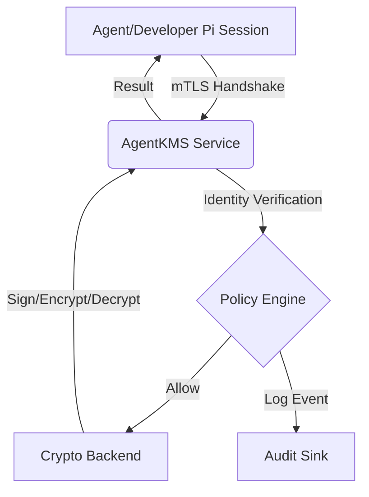

# GDPR Data Flow Diagram

This document describes the flow of personal data through AgentKMS and how it satisfies GDPR requirements for data residency, minimisation, and erasure.

## 1. Data Residency & Processing

AgentKMS acts as a **data processor** for the credentials and cryptographic operations requested by developers and agents.

### 1.1 Data Residency
- **Key Material**: Stored in the configured backend (OpenBao, AWS KMS, GCP KMS). For production, the region of these services is chosen to meet team-specific residency requirements.
- **LLM Credentials**: Managed keys for Anthropic, OpenAI, etc., are stored encrypted in the backend.
- **Audit Logs**: Stored in the configured audit sink (e.g., Elasticsearch, CloudWatch). Retention is configurable per compliance requirements.

### 1.2 Data Flow Diagram

## 2. Data Minimisation

AgentKMS adheres to the principle of data minimisation:
- **No Payload Storage**: AgentKMS never stores the original payload of a cryptographic operation. Only the **SHA-256 hash** of the payload is recorded in audit logs.
- **No Key Exposure**: Private key material is never exposed to the application layer, logs, or diagnostic outputs.
- **Short-lived Identifiers**: Session tokens are valid for 15 minutes and bound to the mTLS connection.

## 3. Key Metadata & Retention

AgentKMS maintains metadata about keys and operations for audit purposes.

| Category | Description | Retention Period |
|---|---|---|
| Key Metadata | Key ID, algorithm, version, creation date | Lifetime of the key + 7 years |
| Audit Logs | Who used which key, when, and for what operation (payload hash only) | 1 year (configurable) |
| Identity Data | Developer cert CN, team ID, SSO mapping | Lifetime of the enrollment |

## 4. Erasure Procedure (Right to Erasure)

Under GDPR Article 17, data subjects have the right to erasure. In the context of AgentKMS, this is satisfied through **cryptographic erasure** (crypto-shredding).

### 4.1 Procedure
1. **Request**: A request is received to erase all data associated with a specific key or user.
2. **Key Deletion**: The associated master key in the backend (e.g., AWS KMS) is marked for deletion and subsequently destroyed.
3. **Audit Mark**: The deletion event is recorded in the audit log.
4. **Result**: All data previously encrypted with the deleted key becomes permanently inaccessible (mathematically unrecoverable).

### 4.2 Handling of Log Data
Personal data within audit logs (e.g., `caller_id`) can be redacted or deleted upon request, subject to overriding legal requirements for financial or security auditing (e.g., PCI-DSS).
